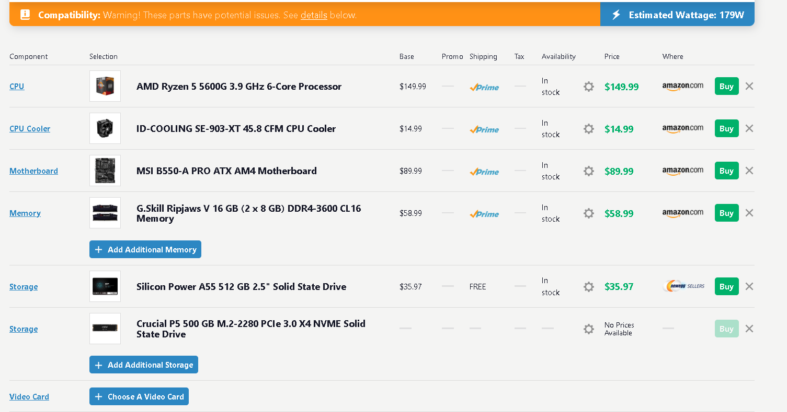
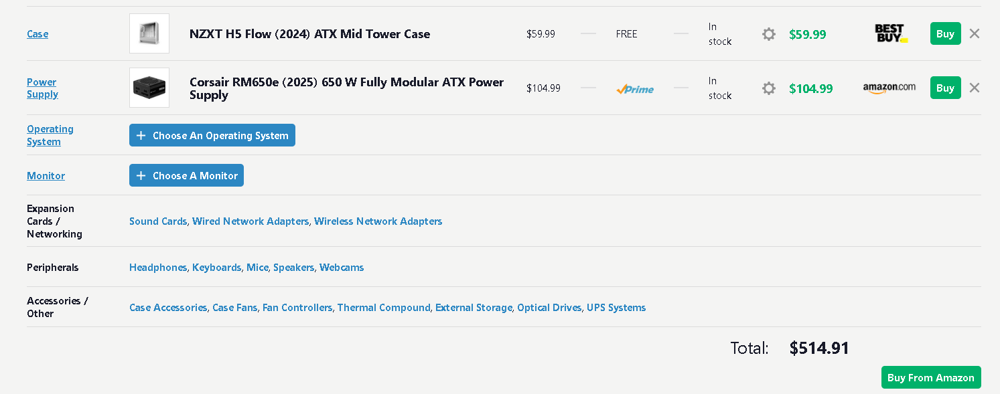
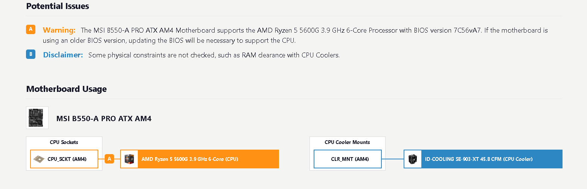

## $580 Business PC Build (No - OS) – Explained

Here’s a breakdown of the components I picked for a reliable, fast, and secure business PC:

---

### CPU: AMD Ryzen 5 5600G (3.9 GHz, 6-Core / 12-Thread)

**Component Summary:**

| Factor            | Details                                      |
| ----------------- | -------------------------------------------- |
| Cores / Threads   | 6 / 12                                       |
| Clock Speed       | 3.9 GHz base                                 |
| Integrated GPU    | Vega graphics                                |
| Power Consumption | Low / efficient                              |
| Use Case          | Office, web, programming, light multitasking |
| Strength          | Performance per dollar, quiet, reliable      |

**Reasons for Choosing:**

* Excellent price-to-performance ratio.
* Integrated graphics eliminates the need for a GPU.
* Efficient power usage → quiet and cool operation.
* Enough cores/threads for multitasking and future-proofing.
* Reliable and widely supported for business workloads.

**Human Text:**
I went with the Ryzen 5 5600G because it strikes a great balance between performance and efficiency. Its 6 cores and 12 threads handle everyday business tasks like office applications, web browsing, and programming without breaking a sweat. Plus, the integrated Vega graphics mean we don’t need a separate GPU, keeping costs and power consumption down. It’s quiet, efficient, and just strong enough to handle multitasking smoothly.

---

### Motherboard: MSI B550-A PRO (ATX, AM4)

**Component Summary:**

| Factor       | Details                          |
| ------------ | -------------------------------- |
| Chipset      | B550                             |
| Form Factor  | ATX                              |
| PCIe Support | 4.0 / 3.0                        |
| Security     | Secure Boot, TPM 2.0             |
| Expansion    | 2× M.2, multiple SATA, USB ports |
| Strength     | Stable, secure, upgrade-friendly |

**Reasons for Choosing:**

* Strong VRM and build quality → reliable power delivery.
* PCIe 4.0 support → future-proof for storage or GPU upgrades.
* Secure Boot → protection against malware at boot.
* TPM 2.0 → hardware encryption and credential security.
* Multiple M.2 and SATA ports → flexible storage expansion.

**Human Text:**
The B550-A PRO is a solid, reliable board with great power delivery for the Ryzen CPU. It supports PCIe 4.0, so if we want to upgrade storage or add a GPU later, we’re covered. It also has modern security features: **Secure Boot** ensures only trusted software can load at startup, protecting against boot-level malware, and **TPM 2.0** gives hardware-based encryption for things like BitLocker and credential protection. For a business PC, having these features built in adds peace of mind without extra cost.

---

### Primary SSD: Crucial P5 500 GB M.2 NVMe

**Component Summary:**

| Factor            | Details                                      |
| ----------------- | -------------------------------------------- |
| Type              | NVMe M.2 2280                                |
| Capacity          | 500 GB                                       |
| NAND Type         | TLC                                          |
| Controller / DRAM | DRAM cache                                   |
| Interface         | PCIe 3.0 x4                                  |
| Strength          | Fast OS/program load, consistent performance |

**Reasons for Choosing:**

* Fast NVMe interface for snappy OS and application performance.
* TLC NAND + DRAM cache → reliable and consistent under load.
* M.2 form factor → clean build, less cable clutter.
* Affordable yet high-performance choice for business workloads.

**Human Text:**
I chose this drive for speed and reliability. It’s a TLC NVMe with DRAM cache, so it’s fast and consistent, perfect for the operating system and programs. PCIe 3.0 x4 gives good sequential read/write speeds, and the M.2 form factor keeps the build neat and uncluttered.

---

### Secondary SSD: Silicon Power A55 512 GB SATA

**Component Summary:**

| Factor     | Details                    |
| ---------- | -------------------------- |
| Type       | SATA 2.5″                  |
| Capacity   | 512 GB                     |
| NAND Type  | 3D TLC (budget)            |
| Controller | DRAM-less                  |
| Use Case   | Secondary storage / backup |
| Strength   | Affordable, low power      |

**Reasons for Choosing:**

* Low-cost way to add extra storage.
* Faster than traditional HDDs → better access times.
* Sufficient for backup, documents, or archives.
* Keeps NVMe drive free for OS and active programs.

**Human Text:**
This is a cost-effective secondary drive for documents, backups, and archives. It’s slower than the NVMe, but for data that doesn’t need lightning-fast access, it’s perfectly fine. It’s an affordable way to expand storage without adding unnecessary cost.

---

### Memory: G.Skill Ripjaws V 16 GB (2 × 8 GB) DDR4-3600 CL16

**Component Summary:**

| Factor   | Details                    |
| -------- | -------------------------- |
| Capacity | 16 GB (2×8 GB)             |
| Speed    | DDR4-3600                  |
| Timings  | CL16                       |
| Channels | Dual                       |
| Use Case | Office, web, programming   |
| Strength | Fast, responsive, reliable |

**Reasons for Choosing:**

* Dual-channel 3600 MHz → maximizes Ryzen performance.
* 16 GB sufficient for most office/business tasks.
* Low latency (CL16) → responsive multitasking.
* Reliable brand → long-term stability.

**Human Text:**
16 GB of fast, dual-channel RAM is more than enough for everyday business tasks. It keeps applications responsive and multitasking smooth, and the low latency means the Ryzen CPU can perform at its best.

---

### Case: NZXT H5 Flow (2024) ATX Mid Tower

**Component Summary:**

| Factor      | Details                        |
| ----------- | ------------------------------ |
| Form Factor | ATX Mid Tower                  |
| Airflow     | Excellent, optimized           |
| Noise       | Quiet                          |
| Features    | Dust filters, cable management |
| Strength    | Cool, quiet, low-maintenance   |

**Reasons for Choosing:**

* Excellent airflow → keeps system cool under load.
* Easy cable management → cleaner, professional build.
* Dust filters → less maintenance over time.
* Quiet operation → suitable for office environments.

**Human Text:**
I picked this case because it’s well-designed for airflow, keeping all components cool and quiet. Cable management is easy, and dust filters make it low-maintenance — important for a PC that will sit in an office for years.

---

### Power Supply: Corsair RM650e (2025) 650 W, Fully Modular, 80+ Gold

**Component Summary:**

| Factor     | Details                         |
| ---------- | ------------------------------- |
| Wattage    | 650 W                           |
| Efficiency | 80+ Gold                        |
| Modular    | Fully                           |
| Capacitors | Japanese, high quality          |
| Use Case   | Reliable business PC power      |
| Strength   | Stable, efficient, long-lasting |

**Reasons for Choosing:**

* Fully modular → clean build, easy upgrades.
* High efficiency → low heat and energy use.
* Quality capacitors → long-term reliability.
* Sufficient wattage → safe headroom for upgrades or extra drives.

**Human Text:**
A high-quality power supply is critical, so I went with a fully modular 80+ Gold unit. It’s efficient, reliable, and built with quality components that will last. Fully modular cables also make building and maintenance easier.

---

### Overall Thoughts

This build hits a sweet spot for a business PC. It’s fast, quiet, and secure, with enough storage and memory for everyday tasks. The motherboard’s Secure Boot and TPM ensure your system is protected, while the NVMe drive keeps performance snappy. Everything fits together without overspending, keeping the total cost at $580 without the OS. It’s a well-balanced machine that should serve reliably for years.

## $580 Business PC in one Glance

| Component                                                   | Summary                                                 | Reasons for Choosing                                                                                        | Key Strengths                                               |
| ----------------------------------------------------------- | ------------------------------------------------------- | ----------------------------------------------------------------------------------------------------------- | ----------------------------------------------------------- |
| **CPU: Ryzen 5 5600G**                                      | 6C/12T, 3.9 GHz, Vega iGPU, low power                   | Great price/performance, integrated GPU saves cost, quiet, efficient, enough cores for multitasking         | Reliable, efficient, fast for office and business workloads |
| **Motherboard: MSI B550-A PRO**                             | ATX, B550, PCIe 4.0, Secure Boot, TPM 2.0, 2× M.2 slots | Stable VRM, PCIe 4.0 future-proofing, security features (Secure Boot + TPM 2.0), multiple expansion options | Secure, upgradeable, reliable                               |
| **Primary SSD: Crucial P5 500 GB NVMe**                     | M.2 NVMe, TLC + DRAM, PCIe 3.0 x4                       | Fast OS and program performance, reliable under load, M.2 saves space                                       | Snappy, consistent, compact                                 |
| **Secondary SSD: Silicon Power A55 512 GB SATA**            | SATA 2.5″, 3D TLC, DRAM-less                            | Affordable extra storage for documents/backups, keeps NVMe free for active programs                         | Low-cost, low power, sufficient for secondary storage       |
| **Memory: G.Skill Ripjaws V 16 GB (2×8 GB) DDR4-3600 CL16** | Dual-channel, 16 GB, CL16                               | Maximizes Ryzen performance, responsive multitasking, sufficient for office tasks                           | Fast, stable, reliable                                      |
| **Case: NZXT H5 Flow (2024)**                               | ATX Mid Tower, excellent airflow, dust filters          | Cool, quiet, easy cable management, low-maintenance                                                         | Good airflow, quiet operation, professional build           |
| **PSU: Corsair RM650e 650 W, 80+ Gold, Fully Modular**      | 650 W, 80+ Gold, Japanese caps, fully modular           | Clean build, efficient, reliable power delivery, headroom for upgrades                                      | Stable, efficient, long-lasting, modular                    |

---

### ✅ Overall

* Fast, quiet, secure, and budget-friendly.
* NVMe for snappy performance + SATA for extra storage.
* Secure Boot + TPM 2.0 built in → enterprise-ready security.
* Efficient PSU and good airflow → long-term reliability.
* Total cost: $580

### Important!

The pictures above show the build composed with the help of [www.pcbuilder.com](http://www.pcbuilder.com). The total here is $514.91, not $580, because the Crucial P5 500GB M.2 SSD had no price listed. According to the official manufacturer website, the price of the component is $64.99 ([https://www.crucial.com/ssd/p5-plus/ct500p5pssd8](https://www.crucial.com/ssd/p5-plus/ct500p5pssd8)).

Furthermore, the website warns us about a BIOS/UEFI compatibility issue between the CPU and the motherboard. This issue is related to the version of the motherboard’s firmware (BIOS/UEFI). From what I have seen, this issue was resolved in 2021. However, if the motherboard’s firmware is out of date, it can be updated without a CPU, as the chosen motherboard features a BIOS flash button directly on the board.